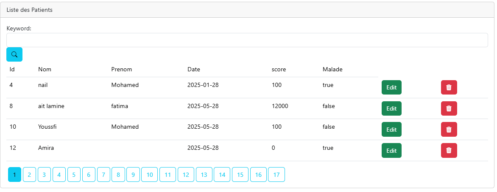
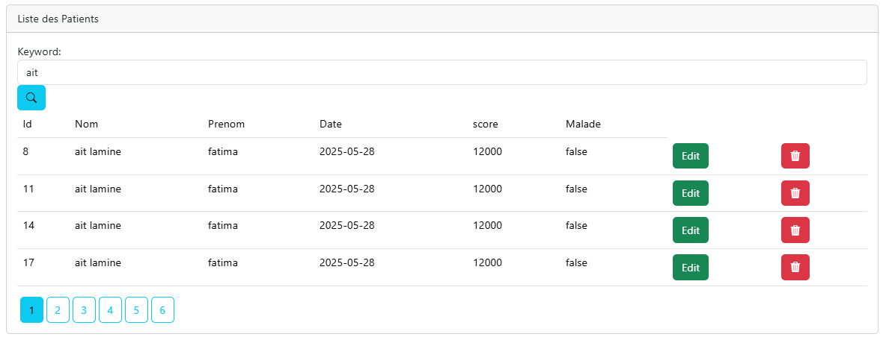
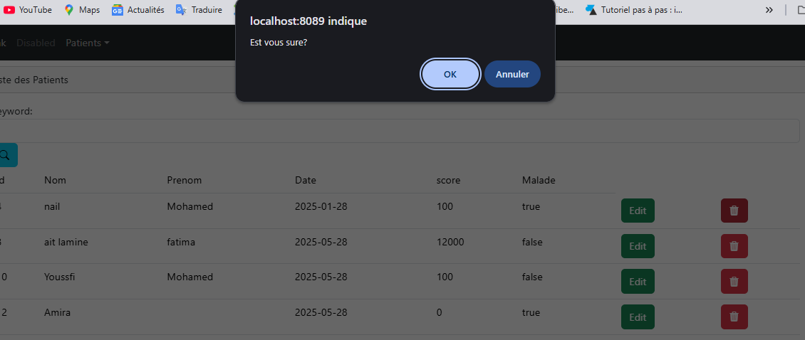
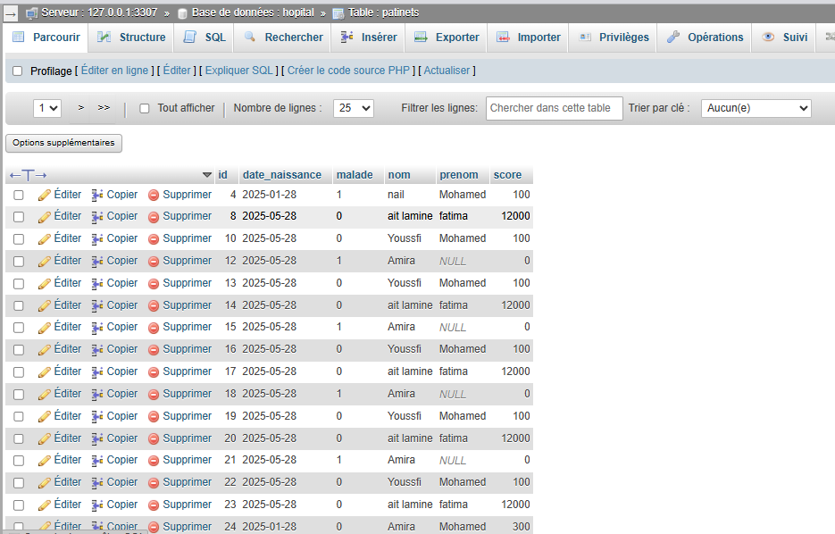
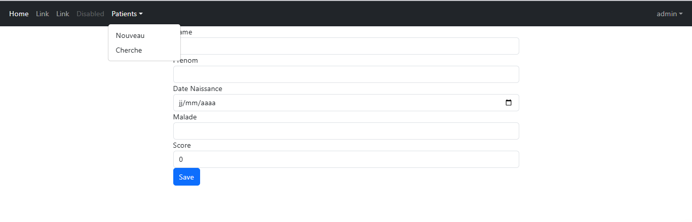
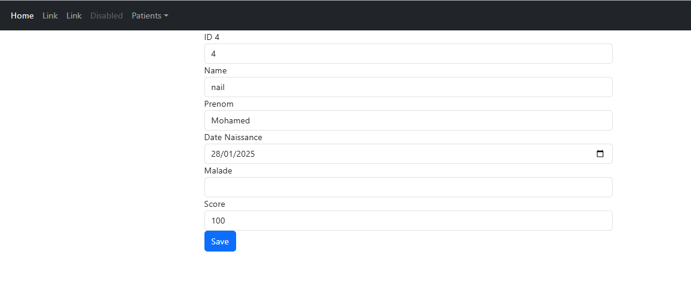

# Partie 1 - Gestion des Patients

---

## 1. Entité Patient

```java
package net.fatima.hospitalapp.entities;

import jakarta.persistence.*;
import jakarta.validation.constraints.DecimalMin;
import jakarta.validation.constraints.NotEmpty;
import jakarta.validation.constraints.Size;
import lombok.*;
import org.springframework.format.annotation.DateTimeFormat;

import java.util.Date;

@Entity
@Table(name = "PATINETS")
@NoArgsConstructor @AllArgsConstructor @Getter @Setter @ToString
@Data
@Builder
public class Patient {
    @Id @GeneratedValue(strategy = GenerationType.IDENTITY)
    private Long id;

    @NotEmpty
    @Size(min = 4, max = 50)
    private String nom;

    private String prenom;

    @Temporal(TemporalType.DATE)
    @DateTimeFormat(pattern = "yyyy-mm-dd")
    private Date dateNaissance;

    @DecimalMin("100")
    private int score;

    private boolean malade;
}
```

**Description :**
Cette classe représente l’entité `Patient` avec ses attributs principaux.

* `@Entity` : indique une table en base.
* `@Table(name = "PATINETS")` : nom de la table.
* Validation sur `nom` (non vide, taille entre 4 et 50).
* `dateNaissance` stockée en type DATE.
* `score` minimum 100.
* Lombok pour générer getters/setters, constructeurs, etc.

---

## 2. Repository Patient

```java
package net.fatima.hospitalapp.repository;

import net.fatima.hospitalapp.entities.Patient;
import org.springframework.data.domain.Page;
import org.springframework.data.domain.Pageable;
import org.springframework.data.jpa.repository.JpaRepository;
import org.springframework.data.jpa.repository.Query;
import org.springframework.data.repository.query.Param;

public interface PatientRepository extends JpaRepository<Patient, Long> {

    Page<Patient> findByNomContains(String keyword, Pageable pageable);

    @Query("select p from Patient p where p.nom like :x")
    Page<Patient> chercher(@Param("x") String keyword, Pageable pageable);
}
```

**Description :**
Interface pour accéder aux données `Patient` dans la base.

* Méthode paginée pour chercher par nom.
* Requête JPQL personnalisée pour recherche avec `like`.

---

## 3. Controller Patient

```java
package net.fatima.hospitalapp.web;

import jakarta.validation.Valid;
import lombok.AllArgsConstructor;
import net.fatima.hospitalapp.entities.Patient;
import net.fatima.hospitalapp.repository.PatientRepository;
import org.springframework.beans.factory.annotation.Autowired;
import org.springframework.data.domain.Page;
import org.springframework.data.domain.PageRequest;
import org.springframework.security.access.prepost.PreAuthorize;
import org.springframework.stereotype.Controller;
import org.springframework.ui.Model;
import org.springframework.validation.BindingResult;
import org.springframework.web.bind.annotation.*;

import java.util.List;

@Controller
@AllArgsConstructor
public class PatientController {

    @Autowired
    private PatientRepository patientRepository;

    @PreAuthorize("hasRole('USER')")
    @GetMapping("/user/index")
    public String index(Model model,
                        @RequestParam(name="page",defaultValue="0") int p,
                        @RequestParam(name = "size",defaultValue ="4" ) int s,
                        @RequestParam(name = "keyword",defaultValue ="" ) String kw) {

        Page<Patient> pagePatients = patientRepository.findByNomContains(kw, PageRequest.of(p, s));
        model.addAttribute("ListPatients", pagePatients.getContent());
        model.addAttribute("pages", new int[pagePatients.getTotalPages()]);
        model.addAttribute("currentPage", p);
        model.addAttribute("keyword", kw);
        return "patients";
    }

    @PreAuthorize("hasRole('ROLE_ADMIN')")
    @GetMapping("/admin/deletePatient")
    public String delete(@RequestParam(name = "id") Long id,
                         @RequestParam(name = "keyword", defaultValue = "") String keyword,
                         @RequestParam(name = "page", defaultValue = "0") int page) {
        patientRepository.deleteById(id);
        return "redirect:/user/index?page=" + page + "&keyword=" + keyword;
    }

    @GetMapping("/patients")
    @ResponseBody
    public List<Patient> listPatients() {
        return patientRepository.findAll();
    }

    @GetMapping("/admin/formPatients")
    @PreAuthorize("hasRole('ROLE_ADMIN')")
    public String formPatients(Model model) {
        model.addAttribute("patient", new Patient());
        return "formPatients";
    }

    @PreAuthorize("hasRole('ROLE_ADMIN')")
    @PostMapping(path = "/admin/save")
    public String save(Model model, @Valid Patient patient, BindingResult bindingResult,
                       @RequestParam(defaultValue = "0") int page,
                       @RequestParam(defaultValue = "") String keyword) {
        if (bindingResult.hasErrors()) return "formPatients";
        patientRepository.save(patient);
        return "redirect:/index?page=" + page + "&keyword=" + keyword;
    }

    @PreAuthorize("hasRole('ROLE_ADMIN')")
    @GetMapping("/admin/editPatient")
    public String editPatients(Model model, Long id, String keyword, int page) {
        Patient patient = patientRepository.findById(id).orElse(null);
        if (patient == null) throw new RuntimeException("Patient not found");
        model.addAttribute("patient", patient);
        model.addAttribute("keyword", keyword);
        model.addAttribute("page", page);
        return "editPatients";
    }

    @GetMapping("/")
    public String home() {
        return "redirect:/user/index";
    }
}
```

**Description :**
Contrôleur qui gère toutes les opérations CRUD sur les patients.

* Page d’accueil avec pagination et recherche.
* Suppression sécurisée par rôle `ADMIN`.
* Formulaire ajout/modification (non montré ici, à venir).
* Accès JSON pour liste complète.
* Redirection de `/` vers `/user/index`.

---

## 4. Vue Thymeleaf `patients.html`
Bien sûr ! Voici un résumé clair et concis avec le **titre**, la **description** courte, le **code essentiel**, et la description de la **capture d’écran** à ajouter dans ton doc ou présentation :

---

### 1. Liste des Patients

**Description :**
Affiche la liste paginée des patients avec leurs informations principales (id, nom, prénom, date de naissance, score, malade) et des actions (éditer, supprimer).

**Code :**

```html
<table>
  <thead>
    <tr><th>Id</th><th>Nom</th><th>Prénom</th><th>Date</th><th>Score</th><th>Malade</th><th>Actions</th></tr>
  </thead>
  <tbody>
    <tr th:each="p : ${ListPatients}">
      <td th:text="${p.id}"></td>
      <td th:text="${p.nom}"></td>
      <td th:text="${p.prenom}"></td>
      <td th:text="${#dates.format(p.dateNaissance, 'dd/MM/yyyy')}"></td>
      <td th:text="${p.score}"></td>
      <td th:text="${p.malade ? 'Oui' : 'Non'}"></td>
      <td>
        <a th:href="@{/admin/editPatient(id=${p.id})}">Edit</a>
        <a onclick="return confirm('Supprimer ce patient ?')" th:href="@{/admin/deletePatient(id=${p.id})}">Delete</a>
      </td>
    </tr>
  </tbody>
</table>
```




---

### 2. Recherche des Patients

**Description :**
Formulaire simple permettant de chercher les patients par nom, avec un champ texte et un bouton de recherche.

**Code :**

```html
<form method="get" th:action="@{/user/index}">
  <input type="text" name="keyword" placeholder="Recherche par nom..." th:value="${keyword}">
  <button type="submit">Rechercher</button>
</form>
```


---

### 3. Suppression d’un Patient

**Description :**
Lien de suppression avec popup de confirmation. En backend, suppression du patient et redirection vers la liste.

**Code front :**

```html
<a onclick="return confirm('Supprimer ce patient ?')" th:href="@{/admin/deletePatient(id=${p.id})}">Delete</a>
```

**Code backend (Spring Boot) :**

```java
@GetMapping("/admin/deletePatient")
public String deletePatient(@RequestParam Long id) {
    patientRepository.deleteById(id);
    return "redirect:/user/index";
}
```



**Description :**
Page web pour afficher la liste paginée des patients.

* Recherche par mot-clé.
* Tableau avec données des patients.
* Boutons Edit/Delete .
* Utilisation de Bootstrap.
* Pagination avec boutons numérotés.
---
Voici ton fichier `README.md` **sans émojis** et avec les **emplacements exacts** où tu peux insérer les **captures d’écran** pour :

* la base de données,
* l’ajout d’un patient,
* la modification d’un patient.

---

## Partie 2 : Formulaire d’ajout et d’édition des patients (avec sécurité et Bootstrap)

---

### Objectif :

Permettre à l’utilisateur (admin ou médecin par exemple) d’**ajouter** ou **modifier** les informations d’un patient via un **formulaire sécurisé**, avec une **interface claire** et un **design responsive** basé sur **Bootstrap**.

---

### Fonctionnalités :

| Fonction         | Détail                                                             |
| ---------------- | ------------------------------------------------------------------ |
| Ajouter patient  | Formulaire pour saisir les infos d’un nouveau patient              |
| Modifier patient | Formulaire pré-rempli pour éditer les infos d’un patient           |
| Sécurité         | Champs obligatoires, validation des données avec feedback d’erreur |
| Interface        | Utilisation de Bootstrap 5 pour une interface propre               |
| Navigation       | NavBar intégrée pour naviguer entre les pages                      |

---

### Structure du fichier HTML (Thymeleaf + Bootstrap)

```html
<!DOCTYPE html>
<html lang="en"
      xmlns:th="http://www.thymeleaf.org"
      xmlns:layout="http://www.ultraq.net.nz/thymeleaf/layout"
      layout:decorate="template">
```

Ce bloc signifie que ce fichier **utilise un template principal** (`template.html`) avec Thymeleaf.

---

### La NavBar (dans le template `template.html`)

```html
<nav class="navbar navbar-expand-lg navbar-dark bg-dark">
  <div class="container-fluid">
    <a class="navbar-brand" href="#">PatientApp</a>
    <div class="collapse navbar-collapse">
      <ul class="navbar-nav me-auto">
        <li class="nav-item"><a class="nav-link" href="/">Accueil</a></li>
        <li class="nav-item"><a class="nav-link" href="/patients">Patients</a></li>
        <li class="nav-item"><a class="nav-link" href="/formPatient">Ajouter</a></li>
      </ul>
    </div>
  </div>
</nav>
```

Cette barre permet une **navigation fluide** entre les sections principales de l’appli.

---

### Le formulaire d'ajout / édition (`formPatients.html`)

> Ce formulaire est **réutilisé** à la fois pour créer un patient **ou** pour **éditer** un existant (avec `th:value` pour pré-remplir les champs).

```html
<form method="post" th:action="@{save}">
```

`th:action="@{save}"` : envoie les données à la méthode `@PostMapping("/save")` du contrôleur Spring.

---

### Champs du formulaire avec validation :

```html
<label for="nom">Name</label>
<input id="nom" class="form-control" name="nom" th:value="${patient.nom}" required>
<span class="text-danger" th:errors="${patient.nom}"></span>
```

Chaque champ est :

* Obligatoire (`required`)
* Lié à l'objet `patient`
* Affiche les erreurs de validation si elles existent (`th:errors`)

Les autres champs sont construits de la même manière :

* Prénom (`prenom`)
* Date de naissance (`dateNaissance`)
* Malade (`malade`) => booléen
* Score (`score`) => entier

---

### Sécurité & Contraintes

Les contraintes de validation sont définies dans la classe **Patient.java**, exemple :

```java
@Entity
public class Patient {
    @Id @GeneratedValue(strategy = GenerationType.IDENTITY)
    private Long id;

    @NotEmpty(message = "Le nom est obligatoire")
    private String nom;

    @NotEmpty(message = "Le prénom est obligatoire")
    private String prenom;

    @Past
    private Date dateNaissance;

    private boolean malade;

    @Min(0) @Max(100)
    private int score;
}
```

Grâce à `javax.validation`, ces contraintes sont **automatiquement vérifiées** et affichées dans le formulaire via `th:errors`.

---

### Contrôleur (Spring MVC)

```java
@Controller
public class PatientController {
    @PostMapping("/save")
    public String savePatient(@Valid Patient patient, BindingResult bindingResult) {
        if (bindingResult.hasErrors()) {
            return "formPatients";
        }
        patientRepository.save(patient);
        return "redirect:/patients";
    }

    @GetMapping("/editPatient")
    public String editPatient(@RequestParam Long id, Model model) {
        Patient patient = patientRepository.findById(id).orElse(null);
        model.addAttribute("patient", patient);
        return "formPatients";
    }
}
```

---

### Captures d’écran à insérer

#### 1. **Base de données (patients listés dans une table)**

*Capture représentant l’interface principale avec tous les patients affichés dans une table.*

### Liste des patients



---

#### 2. **Formulaire d’ajout d’un patient**

*Capture représentant le formulaire vide avec les champs à remplir.*

### Formulaire d’ajout d’un patient




---

#### 3. **Formulaire de modification d’un patient**

*Capture montrant le même formulaire, mais cette fois pré-rempli pour modifier un patient existant.*

### Formulaire de modification d’un patient




